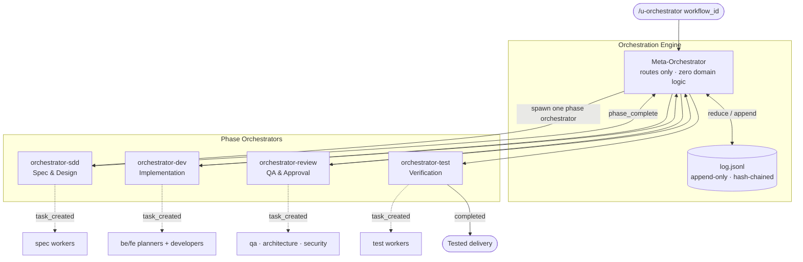

<p align="center">
  
</p>

<h1 align="center">Siegard Code</h1>

<p align="center">
  <strong>An event-driven orchestration engine for Claude Code — it runs multi-phase development workflows from specification to tested delivery, autonomously and fully traceable.</strong>
</p>

<p align="center">
  <a href="#"></a>
  <a href="LICENSE"></a>
  <a href="https://docs.anthropic.com/en/docs/claude-code"></a>
  <a href="#"></a>
  <a href="#"></a>
</p>

<p align="center">
  <em>One log. One entry point. Four phases. Every decision derived from events.</em>
</p>

---

Most AI coding tools chain prompts by hand and lose track between sessions. **Siegard Code 2.0** replaces that with an **event-sourced orchestration engine**: a single append-only log is the source of truth, the orchestrator is a pure function of that log, and every task, retry, failure, and phase transition is an auditable event.

You start a workflow with one command. The meta-orchestrator reads the current phase from the log, runs infrastructure checks, and dispatches the right phase orchestrator — which spawns specialized workers, validates their output against deterministic exit criteria, and advances. Crash mid-run? Re-run the same command — state is reconstructed from the log, not from memory.

> **This is not a product.** It is the agent infrastructure you install into your own projects.

---

## Why Siegard Code 2.0

| Pain point | How Siegard solves it |
|---|---|
| "Prompt chaining is fragile and manual" | **Event-driven dispatch** replaces manual chaining — the engine creates, retries, and completes tasks automatically |
| "State gets lost between sessions" | **The log is the truth.** All state is *derived* — re-run the command and the orchestrator reconstructs exactly where it stopped |
| "I can't tell why the AI did something" | **Evidence mandatory** — every transition cites the `seq` of the event that justified it (invariant P8) |
| "Failures hang the whole run" | **Retry + circuit breaker + DLQ** — failing tasks are isolated, the breaker trips on repeated failures, dead tasks land in a triageable queue |
| "Workers can do anything" | **Least privilege (P6)** — each worker is granted only the tools it needs |
| "Quality is an afterthought" | **Exit criteria live in testable Python**, not in prompts (P11) — a phase cannot advance until its criteria scripts pass |

---

## How it works

Siegard runs a workflow through up to four phases. Each phase has a dedicated orchestrator, a set of workers, and deterministic exit criteria evaluated by Python scripts.

```
sdd  →  dev  →  review  →  test
```



| Phase | Orchestrator | Human interaction | Output |
|---|---|---|---|
| **SDD** — Specification & Design | `orchestrator-sdd` | Confirmation gate (handoff manifest) | `handoff-manifest.yaml` + validated specs |
| **Dev** — Implementation | `orchestrator-dev` | Autonomous (no gates) | Delivery artifacts (`qa_ready: true`) |
| **Review** — QA & Approval | `orchestrator-review` | Approves/rejects QA verdicts | QA verdict files per task |
| **Test** — Verification | `orchestrator-test` | Semi-autonomous | Test results & final completion |

The **meta-orchestrator** runs exactly **one phase per invocation** (bounding context growth) and returns `phase_advanced`; the entry command re-invokes it until the workflow reaches `completed`, `escalated`, `blocked`, or `error`.

> Canonical specification: [`extras/phases.md`](extras/phases.md).

---

## Architecture invariants

These are enforced across every artifact in the engine:

| # | Invariant |
|---|---|
| P1 | Log is the truth. All state is derived. |
| P2 | Orchestrator is a pure function of the log. No own state. |
| P3 | Append-only. Corrections via new events. |
| P4 | Idempotency by key `(task_id, attempt, event_type)`. |
| P5 | Deterministic ordering. Ties resolved by `(priority, seq)`. |
| P6 | Least privilege. Workers have only the tools they need. |
| P7 | Robustness via hooks. Critical guarantees outside the LLM. |
| P8 | Evidence mandatory. Every decision cites the events that justify it. |
| P9 | Every task belongs to exactly one phase. |
| P10 | Phase transition is an auditable event. |
| P11 | Exit criteria in testable code, not in prompts. |
| P12 | Current phase is derived from the log, not stored outside it. |

> **Orchestrators require the foreground.** The meta-orchestrator and phase orchestrators depend on Bash for infra checks, log appends, and worker dispatch. Only read-only leaf workers may run in the background. The engine fails fast with `E_NO_BASH` if Bash is unavailable.

---

## Quick Start

### Prerequisites

- [Claude Code](https://docs.anthropic.com/en/docs/claude-code) installed and configured
- Python 3.10+ (standard library only — **zero external dependencies**)

### Install into your project

There is no install script — installation is a manual copy. Copy the contents of `dist/.claude/` into your project's `.claude/` directory:

```bash
cp -r dist/.claude/. /path/to/your-project/.claude/
```

The copy adds and replaces Siegard-managed files; it does not touch unmanaged files already in your project's `.claude/`.

Then verify installation integrity (from your project root):

```bash
python3 .claude/scripts/verify_install.py
```

It compares every installed file against `.claude/siegard-manifest.json` (SHA-256 per file) and reports drift as a JSON envelope — exit code `0` means the installation is intact. Because no tooling runs at install time, every artifact is **self-describing**: provenance, version, and usage context travel inside the copied files.

### Configure your project's CLAUDE.md (required)

Every pipeline command (`/u-spec`, `/u-dev`, `/u-improve`) reads its configuration from your project's `CLAUDE.md` — at minimum `specs_dir:` and `domain:`. The install ships a complete template; create your `CLAUDE.md` from it:

```bash
# reference: .claude/claude-md-target-template.md (installed with the copy)
```

The preflight gate (`claude_md_config`) fails with an actionable message if these keys are missing — no workflow starts against an unconfigured project.

### Run a workflow

```bash
# Start, resume, or advance a workflow by id
/u-orchestrator fix-kpi-card
```

The orchestrator reads the current phase from `.orch/sessions/<workflow_id>/`, runs preflight checks, enters the correct phase, and drives it to completion — re-invoking itself across phases automatically. If the workflow is new, it initializes the phase declarations; if it already exists, it resumes from the log.

---

## Commands

| Command | Purpose |
|---|---|
| `/u-orchestrator` | **Primary entry point** — start, resume, or advance any workflow from its event log |
| `/u-spec` | Create or evolve technical specifications (SDD phase entry) |
| `/u-dev` | Run an implementation session |
| `/u-improve` | Capture a structured improvement request |
| `/u-reverse-spec` | Generate specs from existing source code |
| `/u-fe-validate` | Frontend code audit against design-system rules |
| `/u-cleanup` | Garbage-collect orphaned blobs, worktrees, and stale sessions |
| `/u-doc-cleanup` | Documentation hygiene pass |

---

## Operations & Resilience

The engine ships operational tooling so workflows survive real-world failure modes:

| Concern | Tool |
|---|---|
| Pre-run environment check | `scripts/preflight.py` (enforces `bash_available`) |
| Repeated-failure protection | `scripts/circuit_breaker.py` + `scripts/evaluate_circuit.py` |
| Dead-letter triage | `scripts/dlq_triage.py` |
| Stuck / stale detection | `scripts/check_stale.py`, `scripts/monitor.py`, `scripts/fix_stuck_improve.py` |
| Retry sequence recovery | `scripts/recover_retry_sequence.py` |
| Escalation handling | `scripts/respond_escalation.py` (see [`ESCALATION_CODES.md`](dist/.claude/ESCALATION_CODES.md)) |
| Run-status classification | `scripts/classify_run_status.py` |
| Garbage collection | `scripts/gc_orphan_blobs.py`, `scripts/gc_worktrees.py`, `scripts/purge.py` |
| Quality gates (outside the LLM) | `hooks/on_subagent_stop.py`, `hooks/on_stop.py` |

The shared engine library lives in `dist/.claude/lib/` (`orch_core.py`, `sm_runner.py`, `minimal_yaml.py`) — pure stdlib, no external dependencies.

---

## Project Structure (this repository)

```
siegard-code/
├── dist/.claude/          # Published artifacts — copied into <target>/.claude/
│   ├── agents/            # orchestrator.md + phase orchestrators + workers (dev/spec/reverse-spec)
│   ├── commands/          # /u-orchestrator and other entry-point commands
│   ├── hooks/             # on_subagent_stop.py, on_stop.py
│   ├── lib/               # orch_core.py, sm_runner.py, minimal_yaml.py (stdlib only)
│   ├── scripts/           # preflight, circuit breaker, DLQ triage, GC, monitor, …
│   ├── skills/            # orch-* engine skills, phase-*-rules, u-* worker skills
│   ├── settings.json      # Claude Code settings for target projects
│   ├── siegard-manifest.json  # versioned inventory (SHA-256 per file)
│   └── ESCALATION_CODES.md
├── docs-en/               # End-user documentation (English)
├── docs/                  # Internal diagrams and flow maps
├── extras/                # Reference specs — canonical: phases.md
├── tests/                 # Validates dist/ artifacts (must pass before release)
├── skills-lock.json       # Locks external skill versions (e.g. ccc)
└── assets/                # Logo and images
```

### Installed layout (in your project)

A workflow's runtime state lives under `.orch/sessions/<workflow_id>/`, with the append-only `log.jsonl` at its core. All other state (current phase, task status, retries) is **derived** from that log on every read.

---

## Release & versioning

This repository ships **versioned distributions**:

1. Change artifacts in `dist/` and pass the test suite (`tests/`)
2. `python3 gen_manifest.py [--version X.Y.Z]` — regenerates the manifest
3. Suite green again → commit → tag `vX.Y.Z`

> Any commit that touches `dist/` **must** regenerate the manifest — `tests/test_manifest_integrity.py` fails on a stale one.

External skills (e.g. `ccc`) are pinned in `skills-lock.json` by source hash, analogous to a package lock.

---

## Documentation

Full end-user documentation lives in **[`docs-en/`](docs-en/README.md)**. The index there maps the v2 architecture; individual guides (flow, installation, agents, workflow engine, specs, artifacts, resilience, invariants) are being authored in upcoming tasks. Until then, the source artifacts under `dist/.claude/` and [`extras/phases.md`](extras/phases.md) are authoritative.

---

## What's new in 2.0

Version 2.0 is an architectural reset. The v1.x model of three agent teams chained by hand is replaced by a **phase-agnostic, event-sourced orchestration engine**:

| | v1.x | v2.0 |
|---|---|---|
| Coordination | Manual prompt chaining between teams | Event-driven dispatch from an append-only log |
| State | Reconstructed from scattered artifacts | Derived from a single hash-chained `log.jsonl` |
| Structure | 3 fixed teams (Spec / Dev / Reverse) | 4 composable phases (`sdd → dev → review → test`) |
| Entry point | Per-workflow commands | One meta-orchestrator (`/u-orchestrator`) that routes by phase |
| Reliability | Quality gates in prompts | Exit criteria + retry + circuit breaker + DLQ in testable Python |
| Guarantees | Convention | 12 enforced architecture invariants (P1–P12) |

---

## License

Licensed under the [Apache License 2.0](LICENSE). See [NOTICE](NOTICE) for attribution details.

---

<p align="center">
  <strong>Siegard Code 2.0</strong> — The log is the truth. Everything else is derived.
</p>
