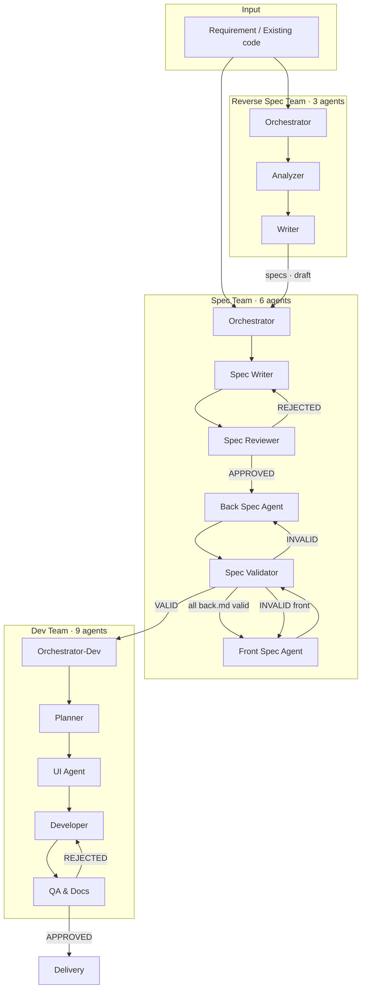

<p align="center">
  
</p>

<h1 align="center">Siegard Code</h1>

<p align="center">
  <strong>Autonomous agent infrastructure for Claude Code that ships features — from spec to delivery.</strong>
</p>

<p align="center">
  <a href="#"></a>
  <a href="LICENSE"></a>
  <a href="https://docs.anthropic.com/en/docs/claude-code"></a>
  <a href="#"></a>
  <a href="#"></a>
</p>

<p align="center">
  <em>18 specialized agents. 3 coordinated teams. One command to orchestrate them all.</em>
</p>

---

Most AI coding tools help you write code. **Siegard Code** manages the entire development lifecycle — it writes specifications, plans backlogs, implements features, runs QA, and delivers tested code. All autonomously, all traceable, all through Claude Code.

You describe what you want. Siegard's agents handle the rest: the Spec team writes and validates technical specifications, the Dev team plans and implements Stories with automated QA, and the Reverse Spec team can even document existing codebases. Every step produces artifacts. Every decision is logged. Every quality gate has teeth.

> **This is not a product.** It is the agent infrastructure you install into your own projects.

---

## Why Siegard Code?

| Pain point | How Siegard solves it |
|---|---|
| "AI writes code but ignores the spec" | Specs are the **single source of truth** — agents trace every line back to a Use Case |
| "No one documents anything" | Documentation is a **byproduct**, not a chore — specs, backlogs, QA reports generated automatically |
| "Context gets lost between sessions" | **Session resume protocol** reconstructs state from disk artifacts — pick up where you left off |
| "AI makes changes I didn't ask for" | **Human confirmation required** at every major gate — nothing ships without your approval |
| "Testing is always an afterthought" | **QA is built into the pipeline** — every Story passes through automated test validation |

---

## Architecture

Three agent teams work in sequence, connected by formal handoff protocols:



| Team | Agents | What it does |
|---|---|---|
| **Spec** | Orchestrator, Writer, Reviewer, Back Spec, Front Spec, Validator | Writes, reviews, and validates technical specifications |
| **Dev** | Orchestrator, Planner, UI Agent, Developer, QA & Docs (×2 FE/BE) | Plans backlogs, implements code, runs QA |
| **Reverse Spec** | Orchestrator, Analyzer, Writer | Reverse-engineers specs from existing code |

---

## Quick Start

### Prerequisites

- [Claude Code](https://docs.anthropic.com/en/docs/claude-code) installed and configured

### Install into your project

Copy the `dist/.claude/` directory into your project:

```bash
cp -r dev-team/dist/.claude/ /path/to/your-project/.claude/
```

This copies all agents, skills, and commands into your project's `.claude/` directory.

### Configure your project

Add these fields to your project's `CLAUDE.md`:

```markdown
domain: backend           # or "frontend" — determines which pipeline runs
stack: Node.js, Express   # your tech stack (agents adapt, not hardcode)
specs_dir: docs/specs     # where specifications live
```

### Run your first command

```bash
# Create a specification from requirements
/u-spec docs/specs

# Implement from approved specs
/u-dev docs/specs my-feature
```

That's it. The orchestrator detects the mode, activates the right agents, and guides you through every step.

---

## Commands

Six slash commands cover the entire development lifecycle:

| Command | Purpose | Output |
|---|---|---|
| `/u-spec` | Create or evolve technical specifications | Approved specs in `{SPECS_DIR}` |
| `/u-dev` | Run a development session (plan → implement → QA) | Tested, delivered code |
| `/u-reverse-spec` | Generate specs from existing source code | Draft specs for review |
| `/u-spec-triage` | Fix spec validation errors incrementally | Corrected specs |
| `/u-improve` | Capture an improvement request | `improve##.md` |
| `/u-bug-report` | Capture a structured bug report | `bug##.md` |

### Workflows

```
Feature (full):       /u-spec  →  /u-dev
Quick improvement:    /u-improve  →  /u-dev
Bug fix:              /u-bug-report  →  /u-dev
Reverse + evolve:     /u-reverse-spec  →  /u-spec  →  /u-dev
```

---

## Key Features

### Spec-First Development
Every feature starts with a validated specification — `openapi.yaml`, use cases, business rules, state machines, screen specs, and navigation flows. No code is written without an approved spec.

### Automatic Mode Detection
The orchestrator reads your project state and selects the right mode: **Spec-first**, **Improve**, **Bug**, **Resume**, or **Reverse-eng review**. No flags, no configuration — it just works.

### Frontend & Backend Pipelines
One command, two pipelines. The `domain:` field in your `CLAUDE.md` routes to the correct agents. Frontend gets a UI Agent for visual specs; backend gets infrastructure dependency tracking.

### Quality Gates with Escalation
- **Spec Reviewer**: Max 3 rejection cycles before human escalation
- **Spec Validator**: Cross-reference validation with coverage reports
- **QA Agent**: Test-gate + full mode with max 3 rework rounds
- Nothing passes silently — every gate produces artifacts

### Token-Efficient Context Management
- **Context mounting**: Each agent receives only what it needs
- **Short mode**: Reactivations use ~2K tokens instead of ~15K
- **Triage mode**: Process 5–10 errors per session, not 20+ at once

### Session Resilience
Interrupted? Run the same command again. The orchestrator reads its log file, reconstructs state from disk artifacts, and resumes from the exact stopping point.

---

## Project Structure

```
your-project/
├── .claude/
│   ├── agents/
│   │   ├── dev/                  # Dev team (FE + BE agents + protocols)
│   │   ├── spec/                 # Spec team (6 agents + protocols)
│   │   └── reverse-spec/         # Reverse Spec team (3 agents + protocols)
│   ├── commands/                 # 6 slash commands
│   └── skills/                   # 20+ reusable skill libraries
├── CLAUDE.md                     # Your project configuration
├── {SPECS_DIR}/
│   ├── _global/                  # Shared: conventions, error codes, glossary
│   ├── domains/{domain}/         # Backend: openapi.yaml + spec.md + back.md
│   └── front/                    # Frontend: screens, flows, design system
└── {SESSIONS_DIR}/
    └── {SESSION}/                # Current session working directory
        ├── backlog.md            # Planned Stories
        ├── us-XX-delivery.md     # Delivery artifacts
        ├── us-XX-qa.md           # QA reports
        └── log-orchestrator-dev.md
```

---

## Action Guide

| I want to... | Commands |
|---|---|
| Build a complete feature | `/u-spec` → `/u-dev` |
| Implement from existing specs | `/u-dev` |
| Fix a bug | `/u-bug-report` → `/u-dev` |
| Apply a quick improvement | `/u-improve` → `/u-dev` |
| Document existing code | `/u-reverse-spec` → `/u-spec` |
| Fix spec validation errors | `/u-spec-triage` |
| Report a spec problem from dev | `/u-spec` (reverse feedback mode) |

---

## Documentation

| Section | Description |
|---|---|
| [Overview](docs-en/01-overview/README.md) | Architecture, concepts, glossary |
| [Installation](docs-en/02-installation/README.md) | Setup and project configuration |
| [Commands](docs-en/03-commands/README.md) | All 6 commands in detail |
| [Agent Teams](docs-en/04-teams/README.md) | Spec, Dev, and Reverse Spec teams |
| [Execution Flows](docs-en/05-flows/README.md) | Step-by-step workflows |
| [Protocols](docs-en/06-protocols/README.md) | 15 on-demand behavioral protocols |
| [Skills](docs-en/07-skills/README.md) | 20+ reusable skill libraries |
| [Artifacts](docs-en/08-artifacts/README.md) | Generated files and lifecycle |
| [Estimates](docs-en/09-estimates/README.md) | Token and time budgets |
| [Resilience](docs-en/10-resilience/README.md) | Failure scenarios and recovery |
| [Reference](docs-en/11-reference/README.md) | Cheat sheet and action guide |

---

## Estimates

| Mode | Tokens | Time | Scope |
|---|---|---|---|
| New spec (full pipeline) | ~19K | 7–12 min | Per domain |
| Fast-track spec change | ~11K | 4–7 min | Per change |
| Development (spec-first) | ~14K | 10–18 min | Per Story |
| Development (improve) | ~10K | 8–13 min | Per Story |
| Triage | ~3K | 1–2 min | Per item |

---

## License

This project is licensed under the [Apache License 2.0](LICENSE). See [NOTICE](NOTICE) for attribution details.

---

<p align="center">
  <strong>Siegard Code</strong> — Because shipping features shouldn't mean losing control.
</p>
