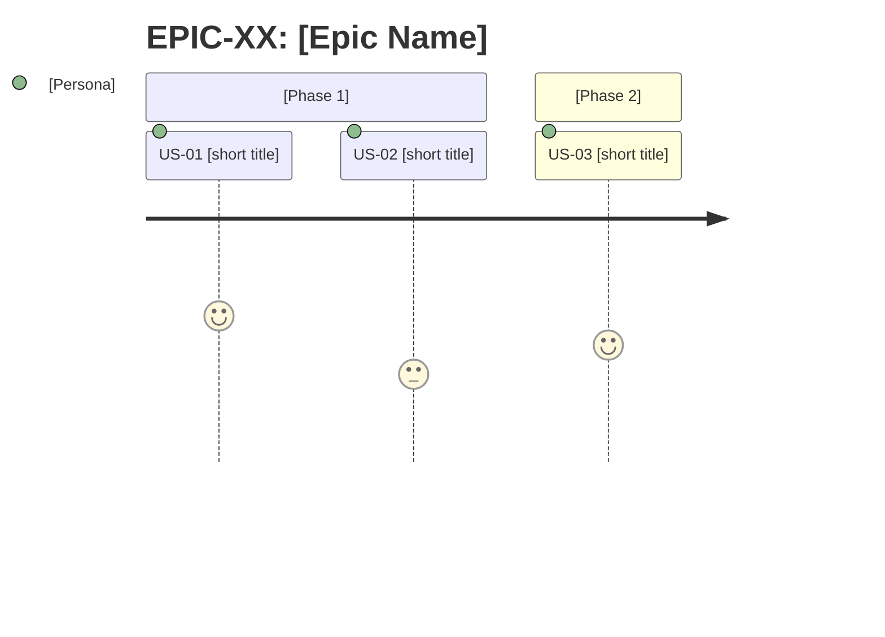

# SKILL: Planning

## Purpose
This skill defines the standards, templates, and quality rules for the Planner Agent to produce consistent, traceable backlogs ready for development.

---

## Canonical templates

### Epic
```markdown
## EPIC-XX: [Epic Name]

**Objective:** [One sentence: what business value this area delivers]
**Affected personas:** [E.g., BI Analyst, Administrator, End Customer]
**Success criterion:** [Observable metric or condition indicating the Epic is complete]
**External dependencies:** [Consumed external APIs, design system, third-party libraries]
**Priority:** High | Medium | Low
**Stories:** [US-XX, US-YY, ...]
```

### User Story
```markdown
### US-XX: [Short descriptive title]

**Epic:** EPIC-XX
**Priority:** P0 — Must Have | P1 — Should Have | P2 — Nice to Have
**As a** [specific persona, not generic],
**I want to** [concrete, observable action],
**So that** [business benefit or user goal].

**Acceptance criteria:**
- [ ] Given [initial system state], When [user action or event], Then [verifiable result]
- [ ] Given [initial system state], When [user action or event], Then [verifiable result]

**Technical notes:**
- [References to components, routes, props, global state, API contracts consumed by the front end]

**Origin:** [UC-NN (spec) | improve##.md | bug##.md | direct requirement]
**Type:** [Feature | Improve | Bugfix | Refactoring]
**Estimate:** S (< 4h, 1 component or isolated fix) | M (4-12h, multiple components or screen flow) | L (> 12h, feature with multiple screens — must be broken down)
**Dependencies:** [US-XX] | None
**Status:** Backlog
```

> **Status field:** the Planner always initializes as `Backlog`. The Orchestrator-Dev is responsible for updating to `In development`, `In testing`, `Done`, etc. as the cycle progresses.

---

## INVEST Framework

Before finalizing any Story, validate the 6 INVEST criteria:

| Criterion | Validation question |
|---|---|
| **I — Independent** | Can this Story be developed and delivered without depending on another in progress? |
| **N — Negotiable** | Can the scope be adjusted without losing the core value? |
| **V — Valuable** | Does it deliver real, observable value to a persona? |
| **E — Estimable** | Can the team estimate the effort without missing information? |
| **S — Small** | Does it fit in a sprint or development cycle? (= estimate S or M) |
| **T — Testable** | Are all acceptance criteria verifiable by automated or manual tests? |

If any criterion fails -> reformulate or break down the Story before including it in the backlog.

---

## Granularity rules

| Signal | Action |
|---|---|
| Story estimated as L (> 12h, feature with multiple screens) | Must be broken down — L does not go to the Developer |
| Story has more than 6 acceptance criteria | Likely 2 stories |
| Story spans more than 2 screens or distinct flows (e.g., list + detail + form) | Split into stories per screen or flow |
| Story depends on another not yet started | Record dependency and reorder |
| Backlog with more than 15 Stories | Deliver by Epic — do not process the entire file at once |

---

## Rules for acceptance criteria

- Each criterion must be **independently testable** — if you cannot write a test for it, reformulate
- Always use **Given/When/Then** — avoids ambiguity about initial state
- **Given** describes the system state, not the user’s intent
- **Then** must be verifiable: prefer "displays message X" over "works correctly"
- Minimum of 2 criteria per Story; if there is only 1, the Story may be too small

**Bad vs. good examples:**

Bad: `The system should work well when the user logs in`
Good: `Given that the user has valid credentials, When they submit the login form, Then they are redirected to the dashboard and see their name in the header`

Bad: `Handle errors`
Good: `Given that the user submits the form with an invalid email, When they click "Sign in", Then they see the message "Invalid email" below the field, without a page reload`

---

## Numbering convention

```
EPIC-01, EPIC-02, ...
US-01, US-02, ...        <- global numbering, not per Epic
```

Stories are numbered sequentially across the entire project — makes cross-referencing easier.

---

## Dependency map

At the end of `backlog.md`, always include:

```markdown
## Dependency map

US-01 -> (none)
US-02 -> US-01
US-03 -> US-01
US-04 -> US-02, US-03
```

Use `->` to indicate "depends on". If there is a cycle, it is a design error — resolve it before delivering the backlog.

---

## Backlog quality checklist

Before saving `backlog.md`, validate:

- [ ] Every Story has at least 2 acceptance criteria in Given/When/Then format
- [ ] No Story is estimated as L without justification for not breaking it down
- [ ] All dependencies are explicit in the map
- [ ] There are no dependency cycles
- [ ] Open questions are marked with `Warning`
- [ ] Personas used in Stories are defined in `CLAUDE.md` or the project context
- [ ] Story order in the backlog respects dependencies (stories without dependencies first)

---

## Personas — how to define

If the project does not have defined personas, the Planner must list them before creating Stories:

```markdown
## Project personas

- **[Name]:** [Who they are, what they do, their primary goal in the system]
- **[Name]:** [...]
```

Generic personas like "user" or "admin" are allowed only if the system truly does not distinguish profiles.

---

## Customization via CLAUDE.md

The project’s `CLAUDE.md` can (and should) override parts of this skill. When reading `CLAUDE.md`, extract:

| What to look for | Used in |
|---|---|
| Defined personas or user profiles | User Story templates |
| Business domain and specific terminology | Acceptance criteria language |
| Technical constraints (e.g., component framework, design system, router routes) | Story technical notes |
| Existing components or pages | Dependencies and technical notes |

If `CLAUDE.md` does not define personas, the Planner must create them in the backlog before writing any Story.

---

## Final backlog.md structure

```markdown
# Backlog

_Created on: YYYY-MM-DD_
_Last updated: YYYY-MM-DD_

---

## Personas
[persona list]

---

## Epics
[list of epics using the canonical template]

---

## Story overview

| ID | Title | Persona | Priority | Epic | Status |
|----|-------|---------|----------|------|--------|
| US-01 | [title] | [persona] | P0 | EPIC-01 | Backlog |
| US-02 | [title] | [persona] | P1 | EPIC-01 | Backlog |

---

## User Stories by priority

### P0 — Must Have
> Without these Stories the product does not work or lacks minimum value.

[P0 stories grouped by epic, in dependency order]

### P1 — Should Have
> Important for the experience, but do not block launch.

[P1 stories grouped by epic, in dependency order]

### P2 — Nice to Have
> Desirable when capacity allows — do not compromise the current cycle if deferred.

[P2 stories grouped by epic, in dependency order]

---

## Dependency map
[text graph]

---

## Journey maps by Epic

> Include for each Epic with 3 or more Stories in mandatory sequence.
> Optional for Epics with parallel or independent Stories.



---

## Open questions
[list of items marked with Warning that need answers before development]
```
