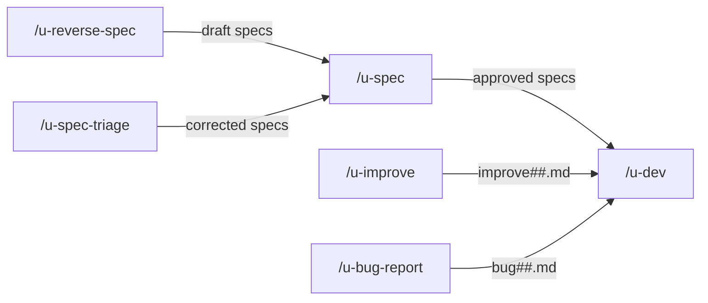

# Commands

The system provides 6 slash commands that serve as entry points for all workflows.

## Command overview

| Command | Purpose | Output |
|---------|---------|--------|
| [`/u-spec`](u-spec.md) | Create or evolve technical specifications | `{SPECS_DIR}` directory |
| [`/u-dev`](u-dev.md) | Orchestrate development session | Implemented code + delivery artifacts |
| [`/u-reverse-spec`](u-reverse-spec.md) | Reverse-engineer specs from existing code | `{SPECS_DIR}` (draft) |
| [`/u-spec-triage`](u-spec-triage.md) | Incrementally fix spec validation errors | Corrected specs |
| [`/u-improve`](u-improve.md) | Capture incremental improvement requests | `improve##.md` |
| [`/u-bug-report`](u-bug-report.md) | Capture structured bug reports | `bug##.md` |

## Variable resolution

All commands resolve variables in the same priority order:

1. **CLAUDE.md field** (canonical source -- highest priority)
2. **Command argument** (fallback -- with warning to configure CLAUDE.md)
3. **Stop and request** if neither is available (`sessions_dir:` has no fallback)

Key variables:
- `{SPECS_DIR}` -- Specifications directory
- `{SESSIONS_DIR}` -- Sessions directory
- `{SESSION}` -- Current session name (always the last argument)
- `{CODE_DIR}` -- Source code directory (used by `/u-reverse-spec`)

## Next steps

- [Execution Flows](../05-flows/README.md) -- See how commands chain together in complete workflows
