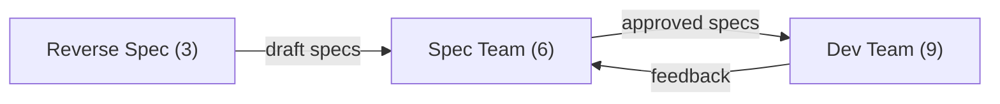

# Agent Teams

The system is organized into 3 specialized teams that work in sequence to deliver features from specification to implementation.

## Team overview

| Team | Agents | Entry point | Output |
|------|--------|-------------|--------|
| **[Spec](spec/README.md)** | 6 | `/u-spec` | Approved specifications |
| **[Dev](dev/README.md)** | 9 (+1 meta-orchestrator for fullstack) | `/u-dev` | Implemented and tested code |
| **[Reverse Spec](reverse-spec/README.md)** | 3 | `/u-reverse-spec` | Draft specifications from code |

## Handoff between teams

- **Reverse Spec -> Spec**: Draft specs are handed to the Spec team for formal review and approval
- **Spec -> Dev**: Approved specs are packaged via the Handoff protocol with pinned versions
- **Dev -> Spec** (feedback): When a Developer discovers a spec problem during implementation, a reverse feedback artifact triggers spec correction

## Agent activation

Agents are never activated directly by the user. The **orchestrator** of each team is the only entry point:
- It detects the operating mode
- Selects which agents to activate
- Loads context per agent using context-mounting protocols
- Manages quality gates and escalation

## Next steps

- [Spec Team](spec/README.md) -- Technical specification agents
- [Dev Team](dev/README.md) -- Implementation and QA agents
- [Reverse Spec Team](reverse-spec/README.md) -- Code analysis agents
