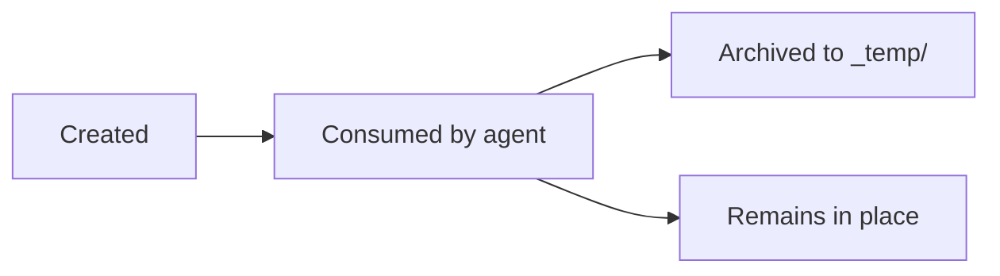

# Artifacts

Complete reference of all files generated by the system, their lifecycle, and archiving behavior.

## Artifact lifecycle

## Complete artifact table

| Artifact | Generated by | Lifecycle | Location |
|----------|-------------|-----------|----------|
| `improve##.md` | `/u-improve` | Archived post-Planner | `{SESSIONS_DIR}/{SESSION}/` -> `_temp/` |
| `bug##.md` | `/u-bug-report` | Archived post-Planner | `{SESSIONS_DIR}/{SESSION}/` -> `_temp/` |
| `{SPECS_DIR}` | Spec team | Permanent | `{SPECS_DIR}/` |
| `openapi.root.yaml` | Spec Writer | Permanent | `{SPECS_DIR}/` |
| `log-orchestrator-spec.md` | Spec Orchestrator | Permanent | `{SPECS_DIR}/` |
| `backlog.md` | Planner | Permanent | `{SESSIONS_DIR}/{SESSION}/` |
| `ui-epic-XX.md` | UI Agent | Archived post-Epic | `{SESSIONS_DIR}/{SESSION}/` -> `_temp/` |
| `us-XX-delivery.md` | Developer | Archived post-Task Contract | `{SESSIONS_DIR}/{SESSION}/` -> `_temp/` |
| `us-XX-qa.md` | QA | Archived post-Task Contract | `{SESSIONS_DIR}/{SESSION}/` -> `_temp/` |
| `us-XX-pending-items.md` | Developer | Permanent | `{SESSIONS_DIR}/{SESSION}/` |
| `tech-debt.md` | Orchestrator | Permanent | `{SESSIONS_DIR}/{SESSION}/` |
| `log-orchestrator-dev.md` | Dev Orchestrator | Permanent | `{SESSIONS_DIR}/{SESSION}/` |
| `log-reverse-spec.md` | Reverse Spec Orchestrator | Permanent | `{SPECS_DIR}/` |
| `analysis-report.md` | Analyzer | Consumed by Writer | `{SPECS_DIR}/_temp/` |

## Detailed references

- [Spec artifacts](specs.md) -- Structure and purpose of specification files
- [Dev artifacts](dev.md) -- Delivery files, QA reports, and backlogs
- [Logs](logs.md) -- Orchestrator log formats and traceability
- [Templates](templates.md) -- Spec template catalog
