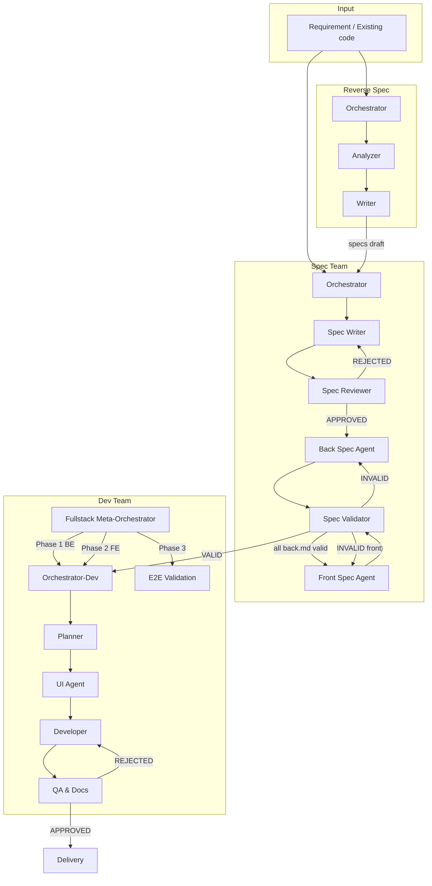

# Overview

This chapter describes the Dev Team Agents system architecture, its teams, and the macro execution flow.

## System composition

The system is composed of **3 agent teams**, each with distinct responsibilities:

| Team | Agents | Scope |
|------|--------|-------|
| **Spec** | 6 agents | Complete technical specification (frontend and backend) |
| **Dev** | 9 agents (+1 fullstack meta-orchestrator) | Code implementation (frontend, backend, or fullstack) |
| **Reverse Spec** | 3 agents | Reverse engineering existing code into specs |

For details on each team, see [Agent Teams](../04-teams/README.md).

## Architecture diagram

## Macro flow

The main flow follows the sequence:

**Input** --> **Spec** --> **Dev** --> **Delivery**

1. **Input** -- A feature requirement or existing code enters the system
2. **Spec** -- The Spec Writer creates the initial specification (openapi.yaml + spec.md). The Reviewer approves or rejects it. After approval, the Back Spec Agent produces the backend technical spec per domain. Only after all .back.md files are valid does the Front Spec Agent produce the frontend spec (front.md, screens, flows) -- since screens may compose multiple domains. The Validator ensures cross-reference consistency
3. **Dev** -- The Planner creates the Story backlog. Each Story is implemented by the Developer (or UI Agent for frontend). QA validates and approves or rejects
4. **Delivery** -- Code implemented, tested, and documented

## Automatic domain routing

The `/u-dev` command automatically routes to the appropriate pipeline based on the `domain:` field in the target project's `CLAUDE.md` (`frontend`, `backend`, or `fullstack`). No manual specification is needed -- the orchestrator reads the configuration and selects the appropriate agents. In fullstack mode, a Meta-Orchestrator coordinates both backend and frontend phases sequentially, ensuring API contracts are implemented before the frontend consumes them.

## Specs as single source of truth

In Spec-first mode, no code is written without an approved spec. The technical specifications (`.spec.md`, `.back.md`, `.screen.md`, `.flow.md`) are the sole source of truth for the Dev Team. Any divergence between code and spec is treated as a bug.

## Next steps

- [Core concepts](concepts.md) -- Understand the central terms and structures of the system
- [Glossary](glossary.md) -- Alphabetical reference of all technical terms
- [Installation](../02-installation/README.md) -- How to install in the target project
