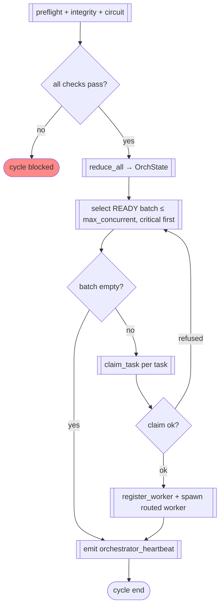

# FLOW-01 — Dispatch cycle

> Flow ID: FLOW-01 | Status: draft | Layer: permanent
> Objective: one orchestrator cycle from infra-check to running workers.
> Domains involved: orch-control, orch-log, orch-state, orch-dispatch, orch-phases.

## 1. Involved use cases

| # | Domain | UC |
|---|--------|----|
| 1 | orch-control | UC-01 run meta cycle, UC-06 foreground guard |
| 2 | orch-state | UC-01 reduce (strict) |
| 3 | orch-dispatch | UC-06 concurrency, UC-03 claim & dispatch, UC-05 routing |
| 4 | orch-log | UC-02 claim task (atomic) |

## 2. Happy path

Steps: 1) infra checks (orch-control UC-01); 2) derive state; 3) pick batch honoring
deps + concurrency; 4) atomic claim — drop refusals; 5) register + spawn; 6) heartbeat.

## 3. Alternative flows

| # | Condition | From | To | Behavior |
|---|-----------|------|----|----------|
| 1a | infra check non-zero | step 1 | end | cycle `blocked`; none dispatched |
| 4a | claim refused (`not_ready`/`task_not_found`) | step 4 | step 3 | drop task from batch; no spawn |
| 3a | breaker tripped | step 3 | end | dispatch halted (ST-03) |
| 5a | routing failure | step 5 | — | `task_failed(select_worker_failed)` (ERR-15) |

## 4. Process rules (FL)

### FL-01 — No spawn without a landed claim
A worker is spawned only after `claim_task` returns an appended event; a refusal removes the task from the batch.

### FL-02 — Heartbeat every cycle
Each cycle ends with `orchestrator_heartbeat` so `detect_stale_orchestrator` sees liveness.

## Changelog

| Version | Date | Author | Type | Description | CR |
|---------|------|--------|------|-------------|----|
| 0.1.0 | 2026-07-09 | orchestration-self-spec | minor | Dispatch cycle flow | — |
