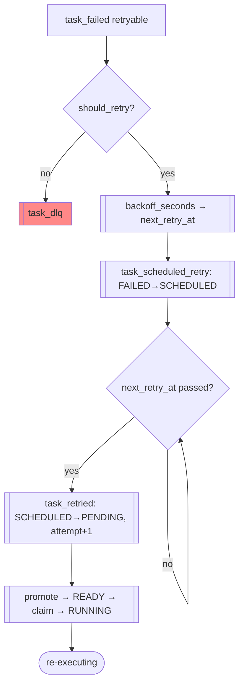

# FLOW-02 — Retry / backoff cycle

> Flow ID: FLOW-02 | Status: draft | Layer: permanent
> Objective: a retryable failure returns to execution through scheduling and backoff.
> Domains involved: orch-resilience, orch-dispatch, orch-state, orch-log.

## 1. Involved use cases

| # | Domain | UC |
|---|--------|----|
| 1 | orch-resilience | UC-04 eligibility, UC-05 backoff, UC-03 schedule retry |
| 2 | orch-dispatch | UC-03 claim & dispatch (due retry) |
| 3 | orch-state | UC-01 reduce; ST-01 transitions |

## 2. Happy path

## 3. Alternative flows

| # | Condition | From | To | Behavior |
|---|-----------|------|----|----------|
| 1a | `retryable=false` OR attempts exhausted | should_retry | DLQ | `task_dlq` (ERR-13/14) |
| 1b | structural reason, attempts ≥ 2 | should_retry | DLQ | cap reached (BR-04) |
| 2a | late completion of prior attempt | after retried | — | superseded straggler no-op (orch-state BR-03) |

## 4. Process rules (FL)

### FL-01 — Attempt monotonicity
`task_retried` bumps `attempts`; events carrying an older attempt are stragglers and no-op.

### FL-02 — One scheduled retry per failure
A failure yields at most one `task_scheduled_retry`; once SCHEDULED, the reaper/orchestrator will not re-schedule (task is no longer FAILED).

## Changelog

| Version | Date | Author | Type | Description | CR |
|---------|------|--------|------|-------------|----|
| 0.1.0 | 2026-07-09 | orchestration-self-spec | minor | Retry/backoff flow | — |
