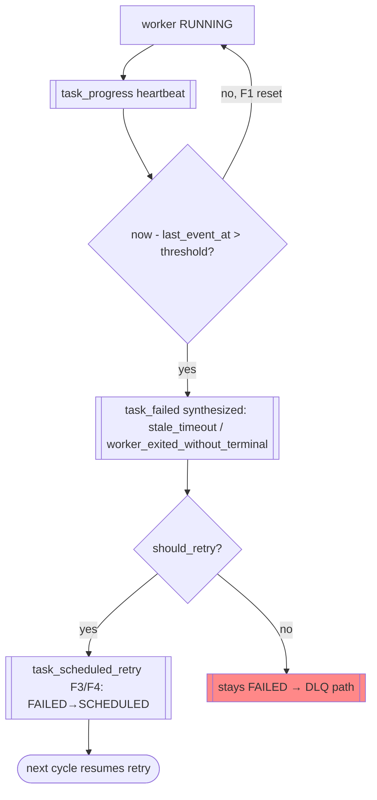

# FLOW-03 — Stale reaping + false-positive reconciliation

> Flow ID: FLOW-03 | Status: draft | Layer: permanent
> Objective: detect a hung worker without killing a live one, and reconcile the log
> if a falsely-reaped worker actually finished. Encodes F1–F4 (SIEGARD reaper report).
> Domains involved: orch-resilience, orch-state, orch-log.

## 1. Involved use cases

| # | Domain | UC |
|---|--------|----|
| 1 | orch-resilience | UC-01 reap, UC-02 synthesize terminal, UC-03 schedule retry |
| 2 | orch-state | UC-01 reduce; BR-04 heartbeat (F1); BR-05 reconciliation (F2) |

## 2. Happy path

## 3. Alternative flows

| # | Condition | From | To | Behavior |
|---|-----------|------|----|----------|
| 1a | live worker finishes AFTER a synthesized FAILED (same attempt, no retry yet) | any | reconciled | `task_completed` accepted as FAILED→COMPLETED + anomaly (F2, orch-state BR-05) |
| 1b | completion over a WORKER-reported FAILED (e.g. `validation_failed`) | — | rejected | `IllegalTransition` (ERR-04) — genuine corruption stays rejected |
| 2a | stop of a still-live sibling within window | UC-02 | deferred | not synthesized (BR-03, SIEGARD BUG-1) |
| 3a | orchestrator turn dies right after failure | UC-03 | resumed | task already SCHEDULED → next invocation retries (BUG-4 closed) |

## 4. Process rules (FL)

### FL-01 — Heartbeats reset the timer (F1)
Staleness is `now - last_event_at`; `task_progress` for the current attempt advances
`last_event_at`. A progressing worker is never reaped.

### FL-02 — Reconcile only synthesized false positives (F2)
`FAILED → COMPLETED` is accepted only when `last_failure_reason ∈ {stale_timeout,
worker_exited_without_terminal}`; recorded as `reconciled_false_positive_completion`.

### FL-03 — Schedule retry atomically (F3/F4)
The reaper/hook emit `task_scheduled_retry` in the same Python call as the failure,
so no LLM turn boundary can strand the task in FAILED.

### FL-04 — Kill is not confirmable
The harness exposes no worker PID; the anti-corruption guarantee is FL-01 (remove the
trigger) + FL-02 (reconcile) + liveness-gated synthesis — not process termination.

## Changelog

| Version | Date | Author | Type | Description | CR |
|---------|------|--------|------|-------------|----|
| 0.1.0 | 2026-07-09 | orchestration-self-spec | minor | Reaping + reconciliation flow (F1–F4) | — |
