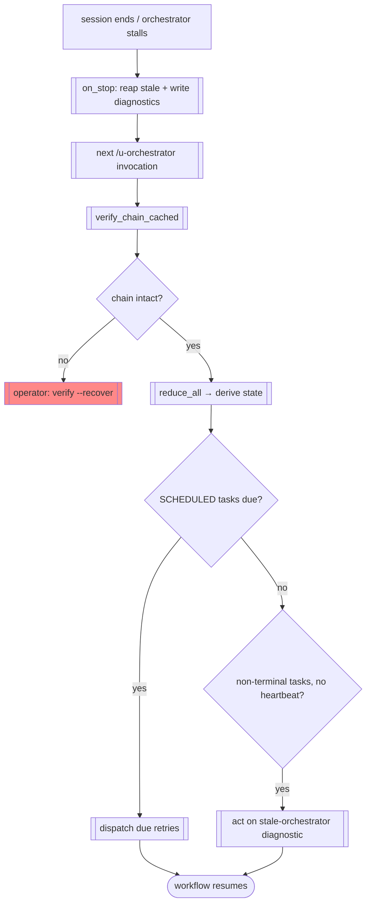

# FLOW-04 — Crash recovery

> Flow ID: FLOW-04 | Status: draft | Layer: permanent
> Objective: a killed session or stalled orchestrator resumes with no lost work and no
> external state, because the log is the truth (INV-01) and the orchestrator is a pure
> function of it (INV-02).
> Domains involved: orch-control, orch-resilience, orch-log, orch-state.

## 1. Involved use cases

| # | Domain | UC |
|---|--------|----|
| 1 | orch-resilience | UC-01 reap (session end), UC-08 detect stalled orchestrator, UC-09 crash recovery |
| 2 | orch-control | UC-07 recover session, UC-01 run meta cycle |
| 3 | orch-log | UC-04 verify chain |

## 2. Happy path

## 3. Alternative flows

| # | Condition | From | To | Behavior |
|---|-----------|------|----|----------|
| D1 | hash chain broken | verify | recover | operator `verify --recover` (UC-05, gated) |
| G1 | illegal transition in log | reduce | escalation | `E12_state_reduction_failed` (ERR-39); tolerant reduce diagnoses |
| B1 | on_stop hook error | on_stop | continue | swallowed (`except: pass`) — never blocks shutdown |

## 4. Process rules (FL)

### FL-01 — No external state to lose
All recovery derives from the log; there is no orchestrator memory to reconstruct (INV-02).

### FL-02 — Scheduled work survives the crash
Because retries are scheduled atomically (FLOW-03 FL-03), a mid-flight failure is already
SCHEDULED and the next invocation resumes it without human intervention.

### FL-03 — Recovery is gated
Destructive `verify --recover` requires `--confirm` + `--from-seq` + `--operator`; the
engine never truncates automatically.

## Changelog

| Version | Date | Author | Type | Description | CR |
|---------|------|--------|------|-------------|----|
| 0.1.0 | 2026-07-09 | orchestration-self-spec | minor | Crash recovery flow | — |
