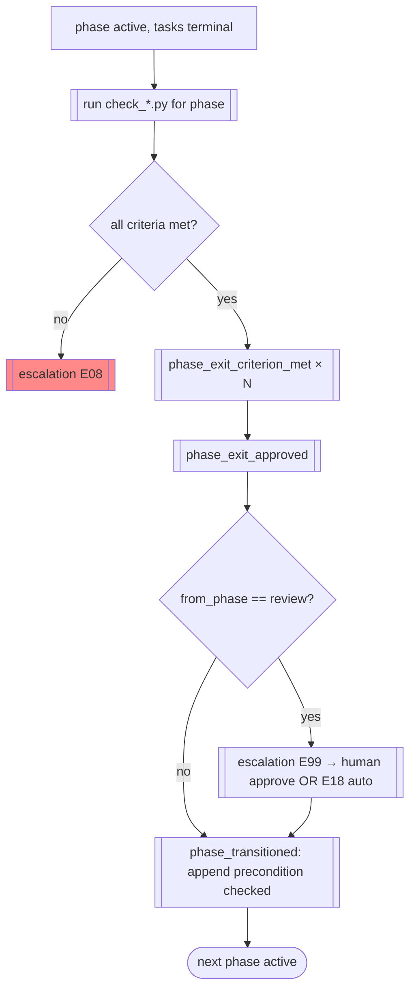

# FLOW-05 — Phase transition + gate

> Flow ID: FLOW-05 | Status: draft | Layer: permanent
> Objective: advance a workflow to the next phase only when code-checked exit criteria
> are met and (where required) a human gate is passed, as an auditable event.
> Domains involved: orch-phases, orch-control, orch-log, orch-state.

## 1. Involved use cases

| # | Domain | UC |
|---|--------|----|
| 1 | orch-phases | UC-03 evaluate criteria, UC-04 approve exit, UC-05 transition |
| 2 | orch-control | UC-03 escalate (gate), UC-04 human response |
| 3 | orch-log | UC-01 append (transition precondition) |

## 2. Happy path

## 3. Alternative flows

| # | Condition | From | To | Behavior |
|---|-----------|------|----|----------|
| C1 | a criterion unmet | criteria | hold | `escalation E08_exit_criteria_not_met` (ERR-35) |
| C2 | DLQ task present | criteria | hold | `E13_dlq_blocks_exit` (ERR-40) — triage first |
| I1 | approval/evidence/human missing | transition | rejected | `PreconditionViolation` (ERR-09); append refused |
| R1 | QA rejects | review | dev | return transition (review→dev) — exempt from forward gate |

## 4. Process rules (FL)

### FL-01 — Criteria are code, not prose (INV-11)
Only a `check_*.py` `met: true` verdict can satisfy an exit criterion.

### FL-02 — Forward transition is guarded (INV-10)
`phase_transitioned` is append-rejected without a preceding `phase_exit_approved`, a valid
`evidence_seq`, and (for review→test) a human approve or `E18`.

### FL-03 — Return transitions bypass the forward gate
review→dev, test→dev, test→review are rejection paths, exempt from the exit gate.

## Changelog

| Version | Date | Author | Type | Description | CR |
|---------|------|--------|------|-------------|----|
| 0.1.0 | 2026-07-09 | orchestration-self-spec | minor | Phase transition + gate flow | — |
