# new_flow — Arquitetura Detalhada

> Referência completa com diagramas de fluxo e estados.
> Fonte de verdade para entender como cada componente funciona, interage e falha.

---

## 1. Visão geral do sistema

O new_flow é um **motor de orquestração event-sourced** para workflows multi-fase no Claude Code. Toda comunicação entre componentes passa pelo log de eventos — nenhum componente armazena estado próprio entre invocações.

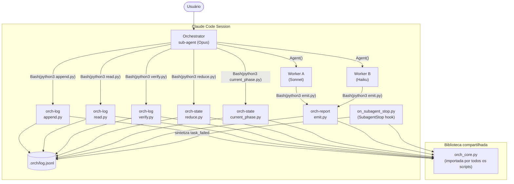

---

## 2. Princípio event-sourced

O log é **append-only** e **imutável**. O estado nunca é gravado diretamente — ele é sempre **reconstruído** pela aplicação sequencial dos eventos.

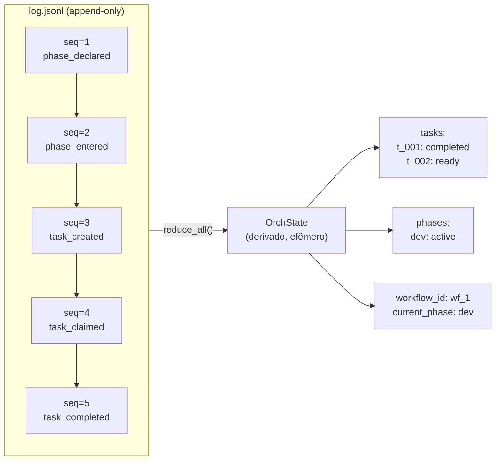

**Cadeia de hashes SHA-256:**

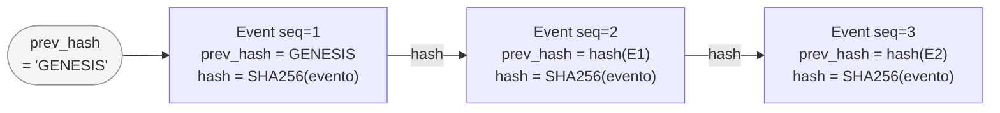

Qualquer adulteração em um evento quebra a cadeia a partir daquele ponto. `verify_chain()` detecta isso em `O(n)`.

---

## 3. Estrutura de arquivos em runtime

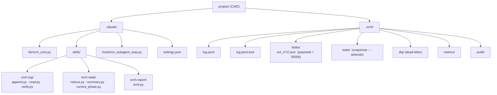

---

## 4. `append_event()` — fluxo interno

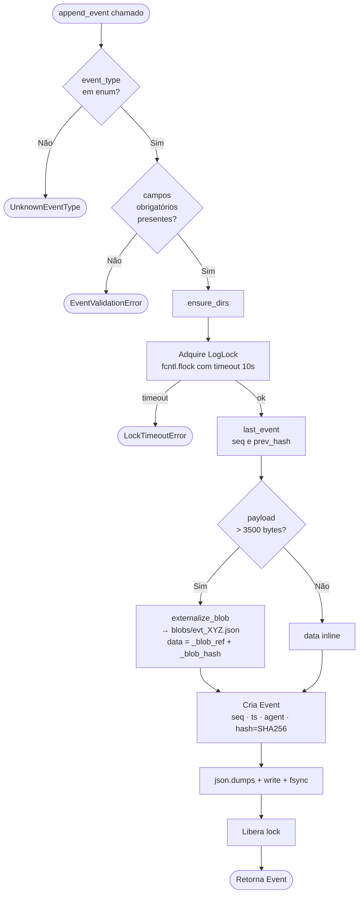

---

## 5. Máquina de estados — Task

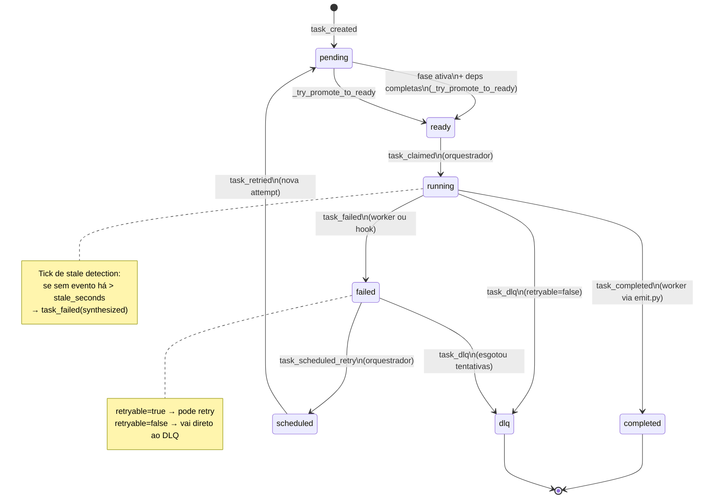

**Promoção automática `pending → ready`** ocorre em dois momentos:
- Quando `task_created` é processado e a fase já está ativa + deps completas
- Quando `phase_entered` é processado (promove todas as tasks pending elegíveis)
- Quando `task_completed` é processado (promove tasks que dependiam desta)

---

## 6. Máquina de estados — Phase

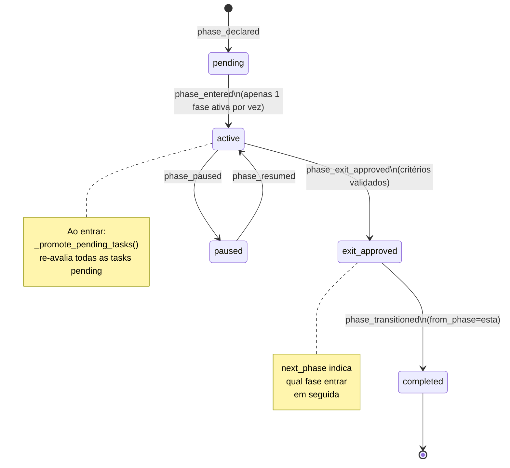

---

## 7. Ciclo do orquestrador

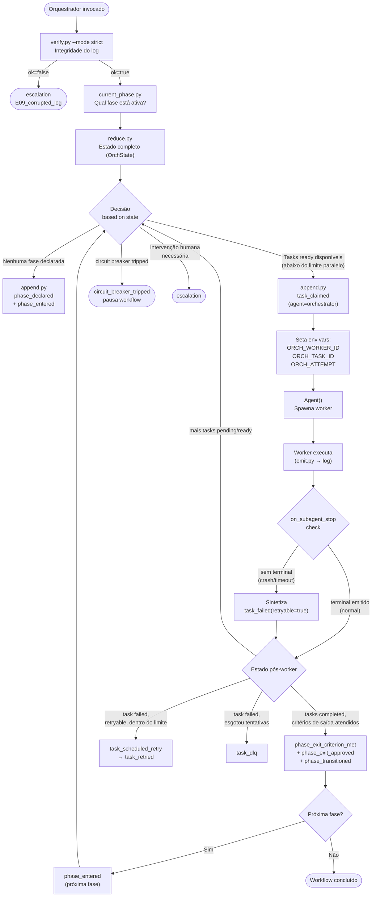

---

## 8. Fluxo worker — sequência completa

```mermaid
sequenceDiagram
    participant O as Orchestrator
    participant L as log.jsonl
    participant E as emit.py
    participant W as Worker
    participant H as on_subagent_stop.py

    O->>L: append task_claimed<br/>(agent=orchestrator, worker_id=w_42)
    Note over O: ORCH_WORKER_ID=w_42<br/>ORCH_TASK_ID=t_001<br/>ORCH_ATTEMPT=1

    O->>W: Agent() — spawna worker

    activate W
    W->>E: emit.py --kind progress<br/>--task-id t_001<br/>--data {note:"processando..."}
    E->>L: append task_progress<br/>(agent=w_42)

    alt Sucesso
        W->>E: emit.py --kind completed<br/>--data {artifacts:[...],summary:"..."}
        E->>L: append task_completed<br/>(agent=w_42)
        deactivate W
        H->>L: _has_terminal → True → no-op
    else Falha explícita
        W->>E: emit.py --kind failed<br/>--data {reason:"...",retryable:true}
        E->>L: append task_failed<br/>(agent=w_42)
        deactivate W
        H->>L: _has_terminal → True → no-op
    else Crash / timeout / context overflow
        deactivate W
        Note over H: SubagentStop hook dispara
        H->>L: read_events_filtered(task_id=t_001)
        H->>L: _has_terminal → False
        H->>L: append task_failed<br/>(agent=w_42,<br/>reason="worker_stopped_without_terminal_event",<br/>retryable=true,synthesized_by=w_42)
    end

    O->>L: reduce.py → novo estado
    O->>O: Decide próxima ação
```

---

## 9. Guard-rail do `emit.py`

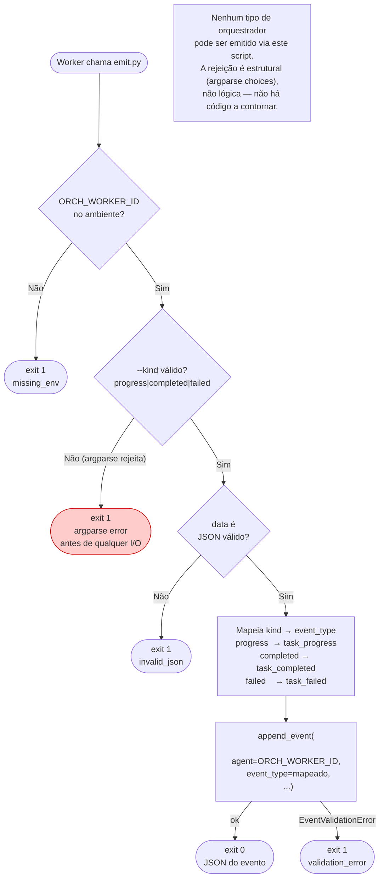

---

## 10. Hook `on_subagent_stop.py`

```mermaid
flowchart TD
    TRIGGER([Claude Code: SubagentStop]) --> READ["Lê stdin (ignora)"]
    READ --> ENV{ORCH_TASK_ID\nORCH_ATTEMPT\nORCH_WORKER_ID\ntodas presentes?}

    ENV -->|"Não (qualquer ausente)"| NOOP1(["exit 0\nnão é contexto orquestrado"])

    ENV -->|"Sim"| TERM{Existe evento\ntask_completed ou task_failed\npara (task_id, attempt)?}

    TERM -->|"Sim"| NOOP2(["exit 0\nterminal já emitido"])

    TERM -->|"Não"| PHASE["Busca phase\nde task_created no log"]
    PHASE --> SYN["append_event(\n  agent=ORCH_WORKER_ID,\n  event_type=task_failed,\n  task_id=ORCH_TASK_ID,\n  attempt=ORCH_ATTEMPT,\n  data={\n    phase: ...,\n    reason: 'worker_stopped_without_terminal_event',\n    retryable: True,\n    synthesized_by: ORCH_WORKER_ID\n  }\n)"]
    SYN --> DONE(["exit 0\n(hook nunca retorna != 0)"])
```

---

## 11. Verificação do log

```mermaid
flowchart TD
    V([verify_chain chamado]) --> EMPTY{Log\nvazio?}
    EMPTY -->|"Sim"| OK1(["ok=True\nevents_verified=0"])
    EMPTY -->|"Não"| ITER["Itera eventos\nprev_hash='GENESIS'"]

    ITER --> EACH{Para cada evento}
    EACH --> CK1{prev_hash\nbate?}
    CK1 -->|"Não"| ERR["error: chain_broken\nseq, expected vs actual"]
    CK1 -->|"Sim"| CK2{compute_hash()\nbate com hash\narmazenado?}
    CK2 -->|"Não"| ERR2["error: hash_mismatch\nseq, expected vs actual"]
    CK2 -->|"Sim"| NEXT["prev_hash = evento.hash\ncount++"]
    NEXT --> EACH

    ERR --> MODE{mode?}
    ERR2 --> MODE
    MODE -->|"strict"| STOP(["ok=False\nfirst_error_seq=N\nstop"])
    MODE -->|"audit"| CONT["Acumula erro\ncontinua iterando"]
    CONT --> EACH

    EACH -->|"fim do log"| DONE
    DONE --> RESULT{Houve erros?}
    RESULT -->|"Não"| OK2(["ok=True\nevents_verified=N"])
    RESULT -->|"Sim (apenas audit)"| FAIL(["ok=False\nerror_details=[...]"])
```

---

## 12. Externalização de blobs

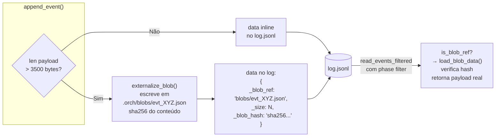

**Portabilidade:** `_blob_ref` é sempre relativo a `ORCH_DIR`, não ao path absoluto. O projeto pode ser movido sem quebrar as referências.

---

## 13. Variáveis de ambiente

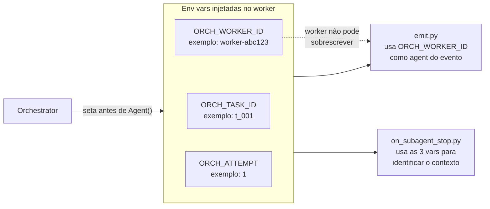

| Variável | Quem seta | Quem lê | Se ausente |
|----------|-----------|---------|------------|
| `ORCH_WORKER_ID` | Orquestrador | `emit.py`, `on_subagent_stop.py` | `emit.py` → exit 1; hook → no-op |
| `ORCH_TASK_ID` | Orquestrador | `on_subagent_stop.py` | hook → no-op |
| `ORCH_ATTEMPT` | Orquestrador | `on_subagent_stop.py` | hook → no-op |

---

## 14. Mapa de campos obrigatórios por evento

### Task lifecycle

| Evento | Campos obrigatórios |
|--------|-------------------|
| `task_created` | `phase`, `tier`, `type`, `spec`, `deps` |
| `task_claimed` | `phase`, `worker_type`, `worker_id` |
| `task_progress` | `phase`, `note` |
| `task_completed` | `phase`, `artifacts`, `summary` |
| `task_failed` | `phase`, `reason`, `retryable` |
| `task_scheduled_retry` | `phase`, `next_retry_at`, `backoff_seconds`, `previous_failure_seq` |
| `task_retried` | `phase`, `previous_attempt`, `scheduled_retry_seq` |
| `task_dlq` | `phase`, `reason`, `last_error` |

### Phase lifecycle

| Evento | Campos obrigatórios |
|--------|-------------------|
| `phase_declared` | `workflow_id`, `phases` |
| `phase_entered` | `phase`, `order` |
| `phase_exit_criterion_met` | `phase`, `criterion` |
| `phase_exit_approved` | `phase`, `criteria_met`, `next_phase` |
| `phase_transitioned` | `from_phase`, `to_phase`, `evidence_seq` |
| `phase_paused` | `phase`, `reason` |
| `phase_resumed` | `phase`, `paused_seq` |

### Management

| Evento | Campos obrigatórios |
|--------|-------------------|
| `escalation` | `code`, `severity`, `reason`, `evidence` |
| `circuit_breaker_tripped`, `human_response`, `snapshot`, `log_recovered`, `preflight_failed` | — |

---

## 15. Retry e tiers

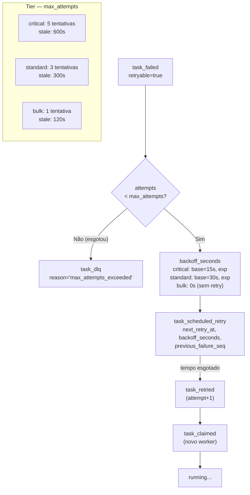

---

## 16. Reduce — fluxo interno do reducer

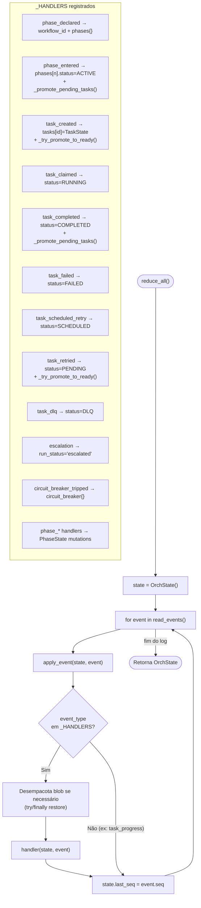

---

## 17. Exceções e tratamento

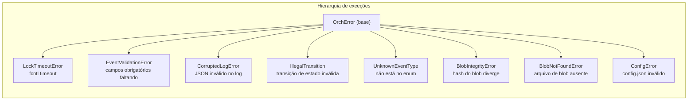

| Exceção | Onde tratada | Comportamento |
|---------|-------------|---------------|
| `LockTimeoutError` | Scripts CLI | exit 1 + JSON de erro |
| `EventValidationError` | `append.py`, `emit.py` | exit 1 + JSON de erro |
| `CorruptedLogError` | `verify.py`, `read.py`, `reduce.py` | exit 1 + JSON de erro; em `strict` pára no primeiro |
| `IllegalTransition` | Logs do orchestrator | escalation E-code |
| `UnknownEventType` | `append.py`, `emit.py` | exit 1 + JSON de erro |
| `BlobIntegrityError` | `read_events_filtered` | propaga como `CorruptedLogError` |
| Qualquer exceção em hook | `on_subagent_stop.py` | silenciada — hook nunca falha |

---

## 18. O que falta implementar (Fase 3+)

```mermaid
graph LR
    subgraph DONE["✅ Implementado (Fases 1+2)"]
        C1["orch_core.py"]
        C2["orch-log skills"]
        C3["orch-state skills"]
        C4["orch-report/emit.py"]
        C5["on_subagent_stop.py"]
    end

    subgraph NEXT["🔜 Fase 3 — Orchestrator + Workers"]
        N1["agents/orchestrator.md\n(sub-agent definition)"]
        N2["agents/workers/\ncode-writer, test-runner,\ncode-reviewer, migration-writer"]
        N3["hooks/on_stop.py\n(métricas finais)"]
    end

    subgraph F4["📋 Fase 4 — Robustez"]
        F1["scripts/preflight.py"]
        F2["scripts/circuit_breaker.py"]
        F3["scripts/dlq_triage.py"]
        F4b["scripts/gc_orphan_blobs.py"]
    end

    subgraph F5["📋 Fase 5 — Phase rules"]
        P1["skills/phase-sdd-rules/"]
        P2["skills/phase-dev-rules/"]
        P3["skills/phase-review-rules/"]
        P4["skills/phase-test-rules/"]
    end

    subgraph DEF["⏩ Deferido"]
        D1["Task 1.8: snapshots\n(orch-state/snapshot.py)"]
    end

    DONE --> NEXT --> F4 --> F5
    DEF -.->|"após Fase 3\ncom dados reais"| NEXT
```
